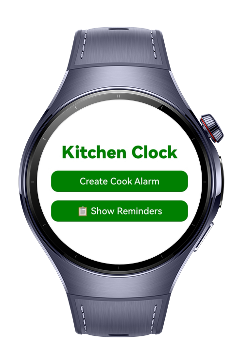
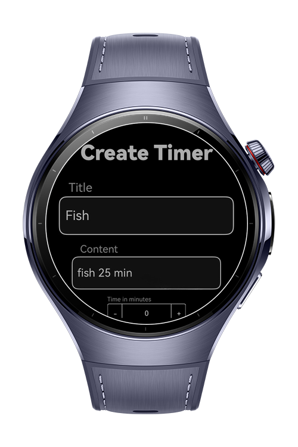
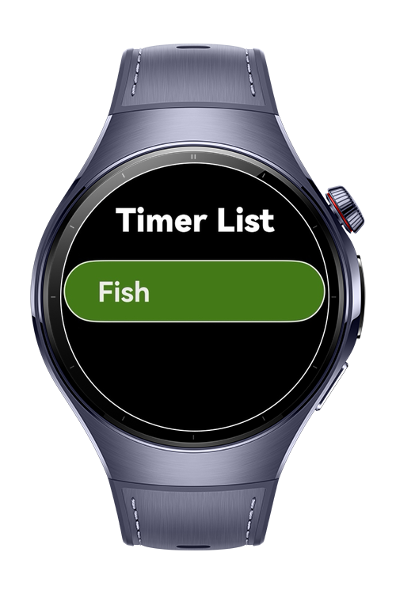
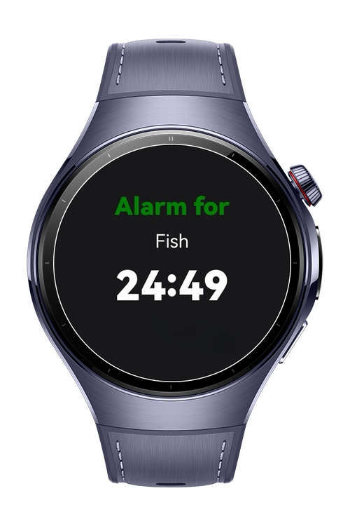

> **Note:** To access all shared projects, get information about environment setup, and view other guides, please visit [Explore-In-HMOS-Wearable Index](https://github.com/Explore-In-HMOS-Wearable/hmos-index).

# KitchenClock

KitchenClock is a HarmonyOS Next wearable app designed to help with cooking by allowing users to set multiple alarms for different dishes.  

When the timer ends, the app notifies the user with **sound alerts**, **vibration**, and **system notifications**, ensuring that cooking time is never missed.

# Preview

<div>
  
  
  
  
</div>

# Use Cases

- Set multiple kitchen timers for different dishes.
- Get notified with sound, vibration, and system notifications when time is up.
- Track remaining time with a countdown timer indicator.


# Technology

## Stack
**Languages**: ArkTS

**Frameworks**: HarmonyOS SDK 5.1.0(18)

**Tools**: DevEco Studio Vers 5.1.0.842

**Libraries**: @kit.BackgroundTasksKit, @kit.SensorServiceKit, @kit.NotificationKit, @kit.MediaKit, @kit.AudioKit

## Required Permissions

- `ohos.permission.KEEP_BACKGROUND_RUNNING`
- `ohos.permission.PUBLISH_AGENT_REMINDER`
- `ohos.permission.VIBRATE` 


# Directory Structure

``` 
entry/src/main/ets/
├── model/
│ ├── ReminderStorageType.ets # Storage type definition for reminders
│ └── SongData.ets # Data model for sound alerts
│
├── pages/
│ ├── CreatePage.ets # Timer creation page
│ ├── DetailsPage.ets # Timer details and controls
│ ├── HomePage.ets # Main home page
│ ├── Index.ets # Entry point page
│ └── ListPage.ets # List of all active timers
│
├── services/
│ ├── AlarmService.ets # Handles alarms, sound, vibration, and reminders
│ └── NavigationService.ets # Navigation between pages
│
├── utils/
│ ├── AVSessionController.ets # Controls AVSessionKit for media playback
│ ├── BackgroundUtil.ets # Keeps app running in background
│ ├── MediaController.ets # Core media control logic
│ └── MediaTools.ets # Helper functions for media handling
│
├── viewmodel/
│ ├── BaseViewModel.ets # Base class for shared state
│ ├── DataModel.ets # Data storage and state handling
│ └── HomeViewModel.ets # Logic for home page timers
│
├── entryability/
│ └── EntryAbility.ets # App ability definition / startup
│
├── module.json5 # App metadata, permissions
└── build-profile.json5 # Build, signing, and SDK info
```

# Constraints and Restrictions

## Supported Device
- Huawei Watch 5


# License

KitchenClock is distributed under the terms of the MIT License.

See the [LICENSE](/LICENSE) for more information.
